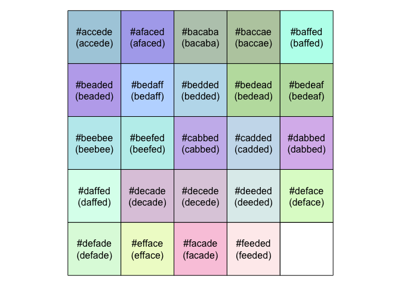

<!-- README.md is generated from README.Rmd. Please edit that file -->

# colourmebad 

<!-- badges: start -->


<!-- badges: end -->

`colourmebad` provides some tools for finding pronouncable
approximations to hex colours.

These tools will be handy if you ever have to memorise a set of hex
colours, or would like to impress people with your recall of a good
colour palette as a party trick. In summary - no one needs these tools.

This package was inspired by [mdsumner](https://twitter.com/mdsumner)’s
[hexwords](https://github.com/mdsumner/hexwords) package.

### What’s in the box

-   `find_best_colour_match()` For each of the reference colours
    supplied, this function will find the best match amongst a list of
    candidate colours. Where ‘best match’ is defined as the shortest
    euclidean distance in
    [Lab](https://en.wikipedia.org/wiki/Lab_color_space) colourspace.
-   `colours_to_words()` and `words_to_colours()` to use some
    digit/letter substitutions and convert a 6-letter word into a hex
    colour and vice versa
-   `show_palette()` to display a single set of colours
-   `compare_palettes()` to show 2 palettes side-by-side
-   Included colour lists
    -   `colour_words` hex colours which are directly readable as
        dictionary words
    -   `colour_words_with_substitutions` hex colours which can be
        converted to dictionary words if certain digit/letter
        substitutions are performed e.g. replay all letter-o with
        number-0 etc.
    -   `nonsense_words` hex colours which could almost be read as a
        pronouncable word but with a very high probability of being
        nonsense/gibberish. e.g. `#elesta`

## Installation

You can install from
[GitHub](https://github.com/coolbutuseless/colourmebad) with:

``` r
# install.package('remotes')
remotes::install_github('coolbutuseless/colourmebad')
```

## Hex colours which are dictionary words

``` r
library(colourmebad)

colour_words
#>  [1] "#accede" "#afaced" "#bacaba" "#baccae" "#baffed" "#beaded" "#bedaff"
#>  [8] "#bedded" "#bedead" "#bedeaf" "#beebee" "#beefed" "#cabbed" "#cadded"
#> [15] "#dabbed" "#daffed" "#decade" "#decede" "#deeded" "#deface" "#defade"
#> [22] "#efface" "#facade" "#feeded"
colourmebad::colours_to_words(colour_words)
#>  [1] "accede" "afaced" "bacaba" "baccae" "baffed" "beaded" "bedaff" "bedded"
#>  [9] "bedead" "bedeaf" "beebee" "beefed" "cabbed" "cadded" "dabbed" "daffed"
#> [17] "decade" "decede" "deeded" "deface" "defade" "efface" "facade" "feeded"

colourmebad::show_palette(colour_words)
```



## Hex colours which are dictionary words if you allow for some digit-letter subsitutions

In the great tradition of “hacker speak” and customised number plates
for cars, digits can be used in place of letters if they look similar
enough.

The default substitutions this package employs:

-   `0` = `o`
-   `1` = `l` (lower case L)
-   `2` = `z`
-   `5` = `s`
-   `7` = `t`
-   `9` = `g`

``` r
cols <- sample(colour_words_with_substitutions, 25)
cols
#>  [1] "#7ea51e" "#9e0da1" "#ba1a7a" "#5099ed" "#de17a5" "#cac7a1" "#b017e1"
#>  [8] "#fe0da1" "#ca77ed" "#add1e5" "#9051e7" "#5ca775" "#d0d1e7" "#5ca1e5"
#> [15] "#c0991e" "#5701e5" "#0b1a7a" "#5add1e" "#501ace" "#ca57e5" "#2abe7a"
#> [22] "#e570c5" "#bab005" "#effe7e" "#e771ed"

colourmebad::colours_to_words(cols)
#>  [1] "teasle" "geodal" "balata" "sogged" "deltas" "cactal" "boltel" "feodal"
#>  [9] "catted" "addles" "goslet" "scatts" "dodlet" "scales" "coggle" "stoles"
#> [17] "oblata" "saddle" "solace" "castes" "zabeta" "estocs" "baboos" "effete"
#> [25] "ettled"
colourmebad::show_palette(cols)
```


## Hex colours which are probably nonsense words but may be pronouncable

``` r
cols <- sample(nonsense_words, 25)
cols
#>  [1] "#9e1ae7" "#fa15e5" "#5e7a75" "#91e052" "#b1009b" "#ce7e77" "#09090a"
#>  [8] "#a91e17" "#ede91a" "#75a570" "#77e75e" "#17e7ca" "#0021a7" "#d00d1e"
#> [15] "#1a091a" "#1ee755" "#cac1a7" "#57a7ed" "#05707a" "#07ae15" "#027ee2"
#> [22] "#05c1a5" "#7e0d01" "#51eac1" "#7ee570"

colourmebad::colours_to_words(cols)
#>  [1] "gelaet" "falses" "setats" "gleosz" "bloogb" "cetett" "ogogoa" "aglelt"
#>  [9] "edegla" "tsasto" "ttetse" "ltetca" "oozlat" "doodle" "laogla" "leetss"
#> [17] "caclat" "stated" "ostota" "otaels" "ozteez" "osclas" "teodol" "sleacl"
#> [25] "teesto"
colourmebad::show_palette(cols)
```


## Creating a pronouncable palette similar to a reference palette

``` r
ref <- RColorBrewer::brewer.pal(8, 'Dark2')

colourmebad::show_palette(ref, labels = ref, title = "Reference Palette")
```


``` r
pronouncable <- colourmebad::find_best_colour_match(ref, colour_words_with_substitutions)
colourmebad::compare_palettes(ref, pronouncable, "ColorBrewer Dark2", "Words with digit/letter substitutions")
```


## Creating a pronouncable nonsense palette similar to a reference palette

``` r
pronouncable <- colourmebad::find_best_colour_match(ref, nonsense_words)
colourmebad::compare_palettes(ref, pronouncable, "ColorBrewer Dark2", "Nonsense words")
```


## Creating a pronouncable Spanish palette similar to a reference palette

``` r
# http://ftp.icm.edu.pl/packages/wordlists/spanish/
spanish_words_with_substitutions <- system('grep -i -E "^[abcdeflsotgz]{6}$" ./working/spanish.txt', intern = TRUE)
cols <- colourmebad::words_to_colours(spanish_words_with_substitutions)
pronouncable_spanish <- colourmebad::find_best_colour_match(ref, cols)
colourmebad::compare_palettes(ref, pronouncable_spanish, "ColorBrewer Dark2", "Spanish words")
```


## Related Software

-   [hexwords](https://github.com/mdsumner/hexwords)

## Acknowledgements

-   R Core for developing and maintaining the language.
-   CRAN maintainers, for patiently shepherding packages onto CRAN and
    maintaining the repository
